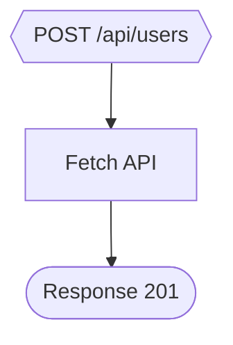

# Flow2Code Usage Guide

A hands-on guide showing every user workflow — from visual-flow compilation to AI-code auditing.

---

## Quick Start

```bash
# Install globally (from npm)
npm install -g @timo9378/flow2code

# pnpm
pnpm add -g @timo9378/flow2code

# yarn
yarn global add @timo9378/flow2code

# Or use directly with npx
npx @timo9378/flow2code --help
```

---

## 1. Initialize a Project

```bash
cd your-nextjs-project
flow2code init
```

**Output:**

```
⚙️  Created .flow2code/config.json
📄 Created example: .flow2code/flows/hello.flow.json
🎉 Zero Pollution init complete!
```

This creates a `.flow2code/` directory with config and an example flow. All flow2code files stay in this directory — zero pollution to your project structure.

---

## 2. Compile a Flow to TypeScript

### Dry Run (preview without writing)

```bash
flow2code compile .flow2code/flows/hello.flow.json --dry-run
```

### Write to file

```bash
flow2code compile .flow2code/flows/hello.flow.json
# ✅ Compiled successfully: src/app/api/hello/route.ts
```

### Options

| Flag | Description |
|------|-------------|
| `--dry-run` | Display generated code, don't write |
| `--platform <name>` | Target: `nextjs` (default), `express`, `cloudflare` |
| `--source-map` | Generate `.flow.map.json` for debugging |
| `-o, --output <path>` | Override output path |

---

## 3. Audit Any TypeScript File (Code Review)

The killer feature — decompile **any** TypeScript file into a visual flow and get audit hints.

### Summary (default)

```bash
flow2code audit src/app/api/users/route.ts
```

```
🔍 Flow2Code Audit: src/app/api/users/route.ts
   Confidence: 95%
   Nodes: 10
   Edges: 10

   ⚡ [trigger_1] POST /api/users (http_webhook)
   🔧 [async_op_1] req.json (custom_code)
   🔀 [if_1] if (!body.email || !body.name) (if_else)
   📤 [response_1] Response 400 (return_response)
   🔧 [fetch_1] Fetch ... (fetch_api)
   ...

📋 Audit Hints:
   🟠 [fetch_1] (line 27): Async operation has no error handling (missing try/catch)
   🔵 [fetch_1] (line 27): Consider checking response.ok after fetch
```

### JSON output (for CI / programmatic use)

```bash
flow2code audit route.ts --format json > flow.json
flow2code audit route.ts --format json -o audit-result.json
```

### Mermaid diagram (paste into GitHub PR)

```bash
flow2code audit route.ts --format mermaid
```



### Target a specific function (multi-handler files)

```bash
# File has GET, POST, DELETE — select POST only
flow2code audit route.ts --function POST

# Disable audit hints
flow2code audit route.ts --no-audit-hints
```

---

## 4. Watch Mode (Auto-Compile)

```bash
flow2code watch .flow2code/flows/
# 👀 Watching: .flow2code/flows/**/*.flow.json + **/*.yaml
# 📁 Output to: .
# Press Ctrl+C to stop
```

Every time you save a `.flow.json` or YAML file, it auto-compiles.

---

## 5. Split / Merge (Git-Friendly Format)

### Split a flow into YAML files

```bash
flow2code split myflow.flow.json
# ✅ Split into 5 files:
#   📄 myflow/meta.yaml
#   📄 myflow/nodes/trigger_1.yaml
#   📄 myflow/nodes/fetch_1.yaml
#   📄 myflow/edges.yaml
```

### Merge back to JSON

```bash
flow2code merge myflow/
# ✅ Merged to: myflow.flow.json
```

---

## 6. Source Map Tracing

```bash
# First, compile with source maps
flow2code compile flow.json --source-map

# Then trace a line number back to its canvas node
flow2code trace src/app/api/hello/route.ts 15
# 🎯 Node mapped to line 15:
#    Node ID:    fetch_1
#    Line range: 12-18
```

---

## 7. Semantic Diff

```bash
flow2code diff old.flow.json new.flow.json
```

Shows which nodes/edges were added, removed, or modified between two versions.

---

## 8. Environment Variable Check

```bash
flow2code env-check myflow.flow.json
# Validates that all env vars referenced in the flow are declared in .env
```

---

## 9. Headless Compiler API (Programmatic Use)

```typescript
import { compile, decompile, validateFlowIR } from "@timo9378/flow2code/compiler";

// Validate IR
const validation = validateFlowIR(myIR);
console.log(validation.valid, validation.errors);

// Compile IR → TypeScript
const result = compile(myIR, { platform: "nextjs" });
console.log(result.code);

// Decompile TypeScript → IR (any code!)
const audit = decompile(tsCode, {
  fileName: "src/app/api/users/route.ts",
  functionName: "POST",
  audit: true,
});
console.log(audit.ir, audit.audit, audit.confidence);
```

---

## 10. Dev Server (Visual Editor)

```bash
flow2code dev
# 🚀 Flow2Code Dev Server
# ├─ Editor:  http://localhost:3100
# ├─ API:     http://localhost:3100/api/compile
# └─ Project: /your/project

flow2code dev --port 4000     # Custom port
flow2code dev --no-open       # Don't auto-open browser
```

---

## Typical Workflow: AI Code Audit

```
1. AI generates code       →  route.ts
2. flow2code audit route.ts  →  Visual flow + Audit hints
3. Fix issues from hints     →  Add try/catch, check response.ok
4. Re-audit to verify        →  flow2code audit route.ts
```

## Typical Workflow: Visual-First Development

```
1. flow2code init              →  Set up project
2. flow2code dev               →  Design flow in visual editor
3. flow2code compile flow.json →  Generate TypeScript
4. flow2code watch             →  Auto-compile on changes
```
